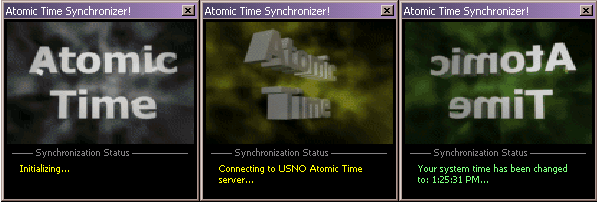

<div align="center">

## Deluxe Atomic Clock Synchronizer\!


</div>

### Description

Have you ever noticed that your computer's clock isn't very accurate? If so, then this code is for you! This program automatically connects to the U.S. Naval Observatory's atomic time server, and retreives the current Coordinated Universal Time (UTC). It then examines your system's time zone settings and daylight savings time settings, adjusts the UTC time based on those settings, and then updates your system time. Depending on your network connection, this program will always set your system clock to within 0.5 seconds of the actual atomic time!
 
### More Info
 
You must have an active network connection for this program to work.


<span>             |<span>
---                |---
**Submitted On**   |2001-04-20 13:31:46
**By**             |[Daniel S\. Soper](https://github.com/Planet-Source-Code/PSCIndex/blob/master/ByAuthor/daniel-s-soper.md)
**Level**          |Intermediate
**User Rating**    |4.4 (22 globes from 5 users)
**Compatibility**  |VB 6\.0
**Category**       |[Miscellaneous](https://github.com/Planet-Source-Code/PSCIndex/blob/master/ByCategory/miscellaneous__1-1.md)
**World**          |[Visual Basic](https://github.com/Planet-Source-Code/PSCIndex/blob/master/ByWorld/visual-basic.md)
**Archive File**   |[Deluxe Ato186034202001\.zip](https://github.com/Planet-Source-Code/daniel-s-soper-deluxe-atomic-clock-synchronizer__1-22560/archive/master.zip)

### API Declarations

```
GetTimeZoneInformation
StretchBlt
```


